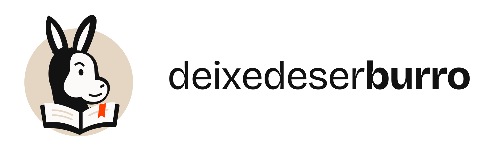

# Marca — deixedeserburro

Esta pasta contém somente a versão final da marca e suas aplicações. O mascote é um burro curioso com um livro aberto; a fita laranja marca a página.

## Arquivos

| Arquivo | Uso |
| --- | --- |
| `logo.svg` / `logo.png` | Assinatura horizontal com mascote e nome, 916×280. PNG com 1600 px de largura. Em Markdown do GitHub use o PNG: o sanitizador de SVG do GitHub come os contornos do nome e sobra só o mascote. No produto, use o SVG. |
| `logo-icon.svg` / `logo-icon.png` | Mascote completo. PNG de 1024 × 1024 px. |
| `wordmark.svg` / `wordmark.png` | Nome isolado, convertido em contornos. |
| `logo-inverse.svg` / `logo-inverse.png` | Assinatura para fundo escuro. |
| `logo-icon-inverse.svg` / `logo-icon-inverse.png` | Mascote para fundo escuro. |
| `logo-icon-duotone.svg` / `logo-icon-duotone.png` | Versão em tinta e papel, com fundo preenchido. |
| `favicon.svg` / `favicon.png` / `favicon.ico` | Retrato simplificado para tamanhos pequenos. |
| `png/` | Ícones em 16, 24, 32, 48, 64, 128, 180, 192, 256, 512 e 1024 px. |

Os SVGs são vetoriais e independentes de fontes externas. Os PNGs têm transparência fora do desenho; o papel do selo e do rosto faz parte da arte.

## Aplicação

- Use o favicon entre 16 e 48 px e o mascote completo a partir de 64 px.
- Prefira pelo menos 320 px de largura para a assinatura horizontal.
- Reserve espaço livre equivalente a 10% da largura do símbolo ao redor da arte.
- Em fundo escuro, use a versão invertida para manter as orelhas visíveis.
- Preserve proporções, cores e orientação. A versão em tinta/papel tem duas cores preenchidas, não um recorte transparente.

## Paleta

As cores seguem os tokens de [frontend/src/styles/tokens.css](../frontend/src/styles/tokens.css).

| Cor | Uso |
| --- | --- |
| `#121212` | Tinta: silhueta, livro e nome |
| `#fbfaf9` | Papel: rosto e páginas |
| `#e5d5c3` | Selo e linhas de página |
| `#ff3e00` | Marcador de página |
| `#343433` | Selo da versão invertida |

O nome usa Bricolage Grotesque, peso 400 em `deixedeser` e 750 em `burro`, convertido em paths nos arquivos finais. Escreva a marca em minúsculas: **deixedeserburro**.

## Licença destes arquivos

O código do repositório está sob [Apache License 2.0](../LICENSE). **Os arquivos deste diretório e o nome deixedeserburro não estão.** A Seção 6 da licença nega permissão para usar nomes comerciais, marcas e nomes de produto do licenciante.

Um fork deve substituir estes arquivos, o nome nos títulos de página e a assinatura do rodapé antes de publicar. Referir-se ao projeto original pelo nome, para descrever origem ou compatibilidade, é uso razoável e não requer permissão. Ver [NOTICE](../NOTICE).
